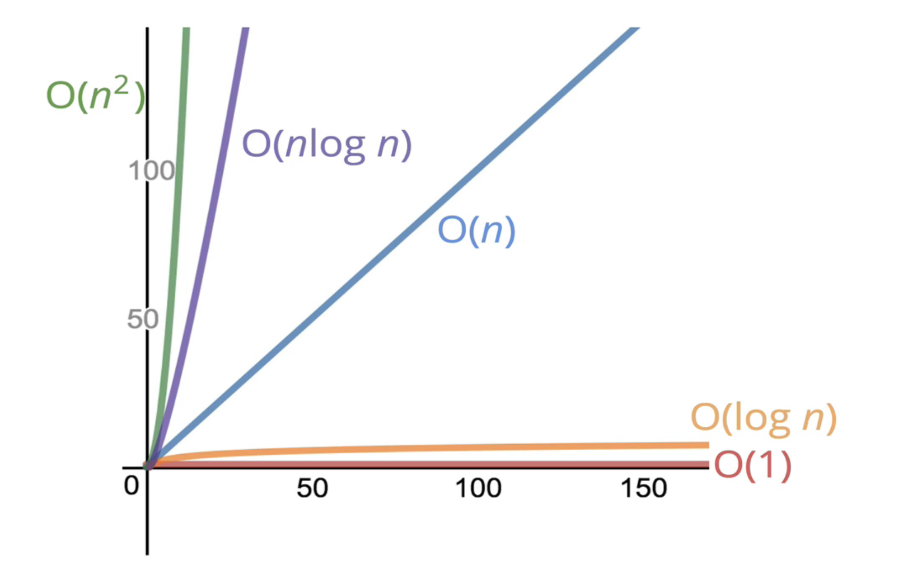

# What Is Big O?
[⬅ Go Back to Home](../README.md)

[⬅ Go Back to Topic ](/big-o.md)

## Notes
- Big O is always worst case scenario (upper bound of run time)

----
### O(1) - Constant
- Best case scenario!

#### Time
- Arithmetic operations
- Variable assignment
- Accessing elements in an array or object by index or key

#### Space
- Most primitives (boolean, numbers, undefined, null)
----
### O(log n) - Logarithm
- Inverse of exponents
- Measures the number of times you can divide the number by 2 before getting a value that's less than or equal to 1
#### Time
- Some searching algos
- Efficient sorting algos

#### Space
- Recursion
----
### O(n) - Linear
#### Time
- Number of operations are bound by a multiple of "n"
  - Runs proportionate with "n"
- Loops (not nested, but not always!!!)

#### Space
- Strings (where n is the string length)
- Reference types (where n is the length of an array of number of keys in an object)
----
### O(n^2) - Quadratic
#### Time
- Nested loops
