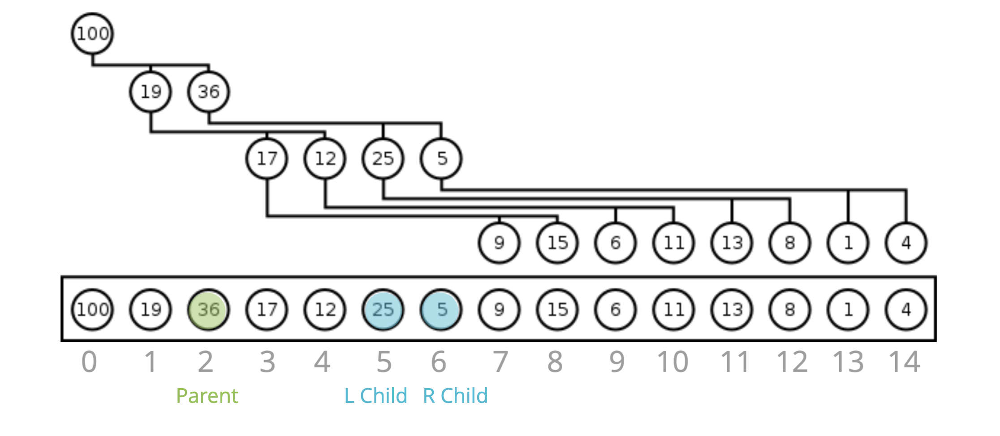
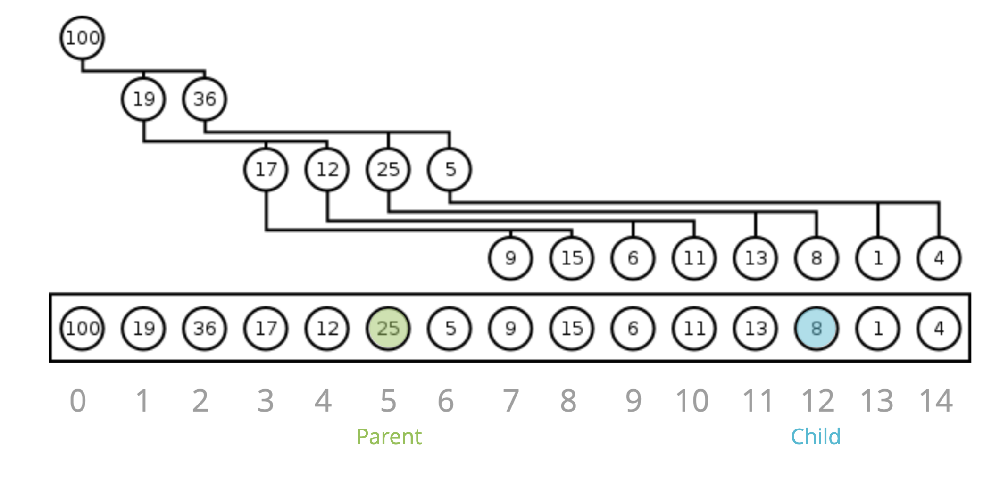
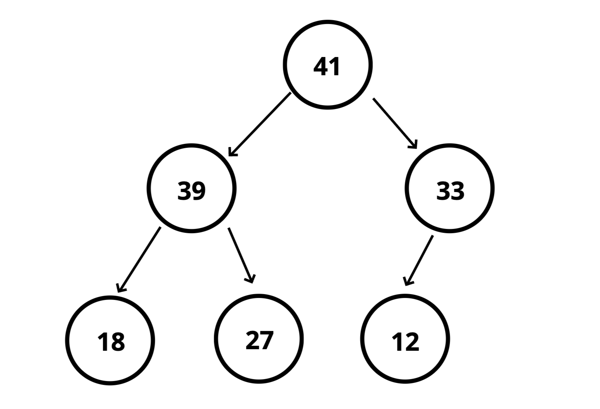
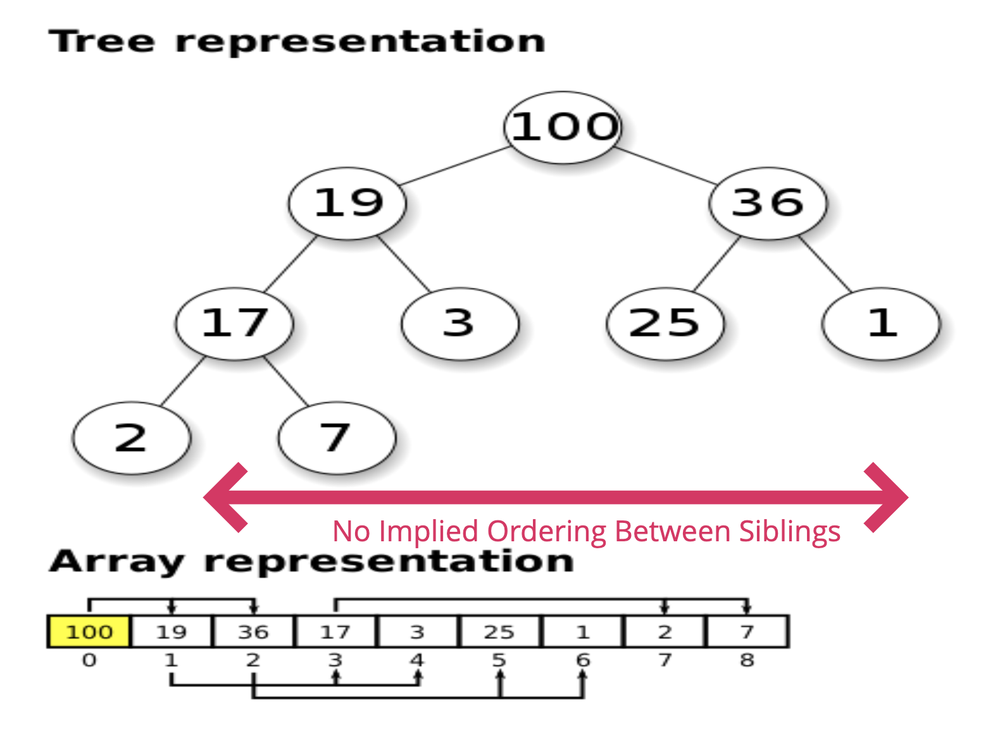
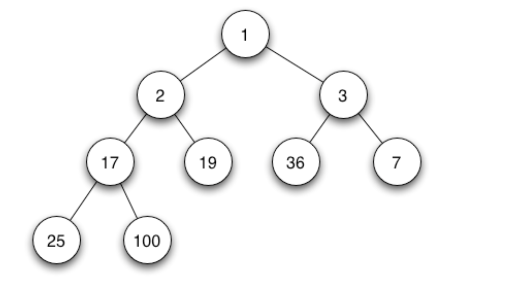

# Binary Heaps
[⬅ Go Back to Home](../README.md)

[⬅ Go Back to Topic](/trees.md)

## Notes
- Very similar to binary search trees, but with different rules
- Used to implement priority queues
- Used with graph traversal algorithms
### Math
#### Parent to Child

- For any index of an array n...
  - The left child is stored at 2n + 1
  - The right child is stored at 2n + 2
#### Child to Parent

- For any child node at index n...
  - Its parent is at index `Math.floor((n-1)/2)`
### MaxBinaryHeap


- In a **MaxBinaryHeap**, parent nodes are always larger than child nodes
- Each parent has at most two child nodes
- The parent is greater than the children but there are not guarantees between sibling nodes
- A binary heap is as compact as possible
  - All the children of each node are as full as they can be and left children are filled out first

### MinBinaryHeap

- In a **MinBinaryHeap**, parent nodes are always smaller than the child nodes

## Big O
- Time: 
  - Insertion: O(log n)
  - Removal: O(log n)
  - Search: O(n)


## Code (for MaxBinaryHeap)
### Full Code
```js
class MaxBinaryHeap {
  constructor() {
    this.values = []
  }
  insert (element) {
    this.values.push(element);
    this.bubbleUp();
  }
  bubbleUp() {
    let idx = this.values.length - 1;
    const element = this.values[idx];
    while(idx > 0) {
      let parentIdx = Math.floor((idx - 1) / 2)
      let parent = this.values[parentIdx]

      if (element <= parent) break;

      this.values[parentIdx] = element;
      this.values[idx] = parent;
      idx = parentIdx;
    }
  }
  extractMax() {
    const max = this.values[0]
    const end = this.values.pop();
    if(this.values.length > 0) {
      this.values[0] = end;
      this.sinkDown();
    }
    return max;
  }
  sinkDown() {
    let idx = 0;
    const length = this.values.length;
    const element = this.values[idx];
    while (true) {
      let leftChildIdx = 2 * idx + 1;
      let rightChildIdx = 2 * idx + 2;
      let leftChild, rightChild;
      let swap = null;

      if (leftChildIdx < length) {
        leftChild = this.values[leftChildIdx]
        if (leftChild > element ) {
          swap = leftChildIdx;
        }
      }
      if (rightChildIdx < length) {
        rightChild = this.values[rightChildIdx];
        if (
          (swap === null && rightChild > element) || 
          (swap !== null && rightChild > leftChild)
          ) {
            swap = rightChildIdx;
        }
      }
      if (swap === null) break;
      this.values[idx] = this.values[swap];
      this.values[swap] = element;
      idx = swap;
    }
  }
}
```
### Breakdown / Pseudocodes
#### *Insert**
- Push the value into the values property on the heap
- Bubble Up:
  - Create a variable called index which is the length of the values property - 1
  - Create a variable called parentIndex which is the floor of (index - 1)/2
  - Keep looping as long as the values element at the parentIndex is less than the values element at the child index
    - Swap the value of the values element at the parentIndex with the value of the element property at the child index
    - Set the index to be the parentIndex, and start over!
  ```js
  insert (element) {
    this.values.push(element);
    this.bubbleUp();
  }
  bubbleUp() {
    let idx = this.values.length - 1;
    const element = this.values[idx];
    while(idx > 0) {
      let parentIdx = Math.floor((idx - 1) / 2)
      let parent = this.values[parentIdx]

      if (element <= parent) break;

      this.values[parentIdx] = element;
      this.values[idx] = parent;
      idx = parentIdx;
    }
  }

  // heap -> [41, 39, 33, 18, 27, 12]
  // heap.insert(55)
  // [41, 39, 33, 18, 27, 12, 55]
  // [41, 39, 55, 18, 27, 12, 33]
  // [55, 39, 41, 18, 27, 12, 33]
  ```
#### **Remove** - aka extractMax
- Swap the first value in the values property with the last one
- Pop from the values property, so you can return the value at the end
- Have the new root "sink down" to the correct spot...
  - Your parent index starts at 0 (the root)
  - Find the index of the left child: 2 * index + 1(make sure its not out of bounds)
  - Find the index of the right child: 2 * index + 2(make sure its not out of bounds)
  - If the left or right child is greater than the element... swap
    - If both left and right children are larger, swap with the largest child
  - The child index you swapped to now becomes the new parent index
  - Keep looping and swapping until neither child is larger than the element
  - Return the old root
  ```js
  extractMax() {
    const max = this.values[0]
    const end = this.values.pop();
    if(this.values.length > 0) {
      this.values[0] = end;
      this.sinkDown();
    }
    return max;
  }
  sinkDown() {
    let idx = 0;
    const length = this.values.length;
    const element = this.values[idx];
    while (true) {
      let leftChildIdx = 2 * idx + 1;
      let rightChildIdx = 2 * idx + 2;
      let leftChild, rightChild;
      let swap = null;

      if (leftChildIdx < length) {
        leftChild = this.values[leftChildIdx]
        if (leftChild > element ) {
          swap = leftChildIdx;
        }
      }
      if (rightChildIdx < length) {
        rightChild = this.values[rightChildIdx];
        if (
          (swap === null && rightChild > element) || 
          (swap !== null && rightChild > leftChild)
          ) {
            swap = rightChildIdx;
        }
      }
      if (swap === null) break;
      this.values[idx] = this.values[swap];
      this.values[swap] = element;
      idx = swap;
    }
  }
  // heap -> [55, 39, 41, 18, 27, 12, 33]
  // heap.extractMax() // 55
  // [33, 39, 41, 18, 27, 12]
  // [41, 39, 33, 18, 27, 12]
  ```