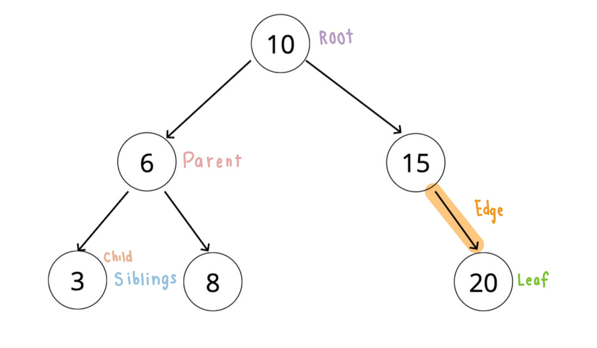

# Binary Search Trees
[⬅ Go Back to Home](../README.md)

[⬅ Go Back to Topic](/trees.md)



## Notes
- A data structure that consists of nodes in a parent/child relationship
- Lists are linear, trees are **nonlinear**
- Nodes can have **AT MAX** two children
- Has exactly 1 root
- Has exactly 1 p ath between root and any node3
- MUST BE SORTED!
  ### - **Left children nodes** are LESS than parent node, **right children nodes** are GREATER than parent node

## Big O
- Time:
  - Insertion -  O(log n)
  - Searching - O(log n)

## Code
### Full Code
```js
class Node {
  constructor(val) {
    this.val = val;
    this.left = null;
    this.right = null;
  }
}

class BinarySearchTree {
  constructor() {
    this.root = null;
  }
  insert(val) {
    let newNode = new Node(val);
    if (this.root === null) {
      this.root = newNode;
      return;
    } else {
      let current = this.root;
      while (true) {
        if (val === current.val) return undefined;
        if (val < current.val) {
          if (current.left === null) {
            current.left = newNode;
            return this;
          } else {
            current = current.left;
          }
        } else if (val > current.val) {
          if (current.right === null) {
            current.right = newNode;
            return this;
          } else {
            current = current.right;
          }
        }
      }
    }
  }
  insert(val) {
    let newNode = new Node(val);
    if (this.root === null) {
      this.root = newNode;
      return;
    } else {
      let current = this.root;
      while (true) {
        if (val === current.val) return undefined;
        if(val < current.val) {
          if(current.left === null) {
            current.left = newNode;
            return this;
          } else {
            current = current.left;
          }
        } else if (val > current.val) {
          if (current.right === null) {
            current.right = newNode;
            return this;
          } else {
            current = current.right;
          }
        }
      }
    }
  }
}
```
### Breakdown / Pseudocodes
#### **Insert**
- This function should accept a value
- Create a new node
- Starting at the root
  - Check if there is a root
    - If not, the root now becomes that new node
    - If there is a root, check if the value of the node is greater than or less than the value of the root
      - If it is greater
        - Check to see if there is a node to the right
          - If there is, move to that node and repeat these steps
          - If there is not, add that node as the right property
      - If it is less
        - Check to see if there is a node to the left
          - If there is, move to that node and repeat these steps
          - If there is not, add that node as the left property
  ```js
  insert(val) {
    let newNode = new Node(val);
    if (this.root === null) {
      this.root = newNode;
      return;
    } else {
      let current = this.root;
      while (true) {
        if (val === current.val) return undefined;
        if(val < current.val) {
          if(current.left === null) {
            current.left = newNode;
            return this;
          } else {
            current = current.left;
          }
        } else if (val > current.val) {
          if (current.right === null) {
            current.right = newNode;
            return this;
          } else {
            current = current.right;
          }
        }
      }
    }
  }
  ```

#### **Find / Contains**
- This function should accept a value
- Starting at the root, check if there is a root
  - If not, we're done searching
  - If there is a root, check if the value of the new node is the value we are looking for
    - If we found it, we are done
    - If not, check to see if the value is greater than or less than the value of the root
      - If it is greater
        - Check to see if there is a node to the right
          - If there is, move to that node and repeat these steps
          - If not, we are done searching
      - If it is less
        - Check to see if there is a node to the left
          - If there is, move to that node and repeat these steps
          - If not, we are done searching
  ```js
  contains(val) {
    if (this.root === null) return false;
    let current = this.root;
    let found = false
    while (current && !found) {
      if (val < current.val) {
        current = current.left;
      } else if (val > current.val) {
        current = current.right;
      } else {
        found = true;
      }
    }
    return false;
  }
  ```