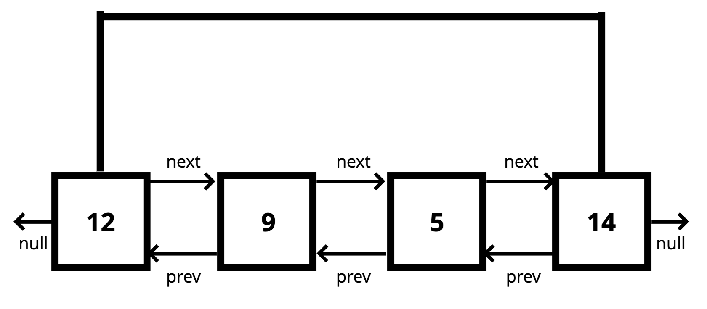

# Doubly Linked Lists
[⬅ Go Back to Home](../README.md)

[⬅ Go Back to Topic](/linked-lists.md)



## Notes
- Almost identical to Singly Linked Lists but...
  - Each node has two pointers (next and previous)
  - Better than Singly Linked Lists for finding nodes and can be done in half the time
  - More memory (extra pointer) === more flexibility

## Big O
- Time: 
  - Insertion - O(1)
  - Removal - O(1)
  - Searching - O(n) (technically O(n/2) but that's still O(n))
  - Access - O(n)

## Code
### Full Code
```js
class Node {
  constructor(val) {
    this.val = val;
    this.next = null;
    this.prev = null;
  }
}

class DoublyLinkedList {
  constructor() {
    this.length = 0;
    this.head = null;
    this.tail = null;
  }
  push(val) {
    let newNode = new Node(val);
    if (!this.head) {
      this.head = newNode;
      this.tail = newNode;
    } else {
      this.tail.next = newNode;
      newNode.prev = this.tail;
      this.tail = newNode
    }
    this.length++;
    return this;
  }
  pop() {
    if (!this.head) return undefined;
    let popped = this.tail;
    if (this.length === 1) {
      this.head = null;
      this.tail = null; 
    } else {
      this.tail = this.tail.prev;
      this.tail.next = null;
      popped.prev = null;
    }
    this.length--;
    return popped
  }
  shift() {
    if (this.length === 0) return undefined;
    let oldHead = this.head;
    if (this.length === 1) {
      this.head = null;
      this.tail = null;
    } else {
      this.head = oldHead.next;
      this.head.prev = null;
      oldHead.next = null;
    }
    this.length--;
    return oldHead
  }
  unshift(val) {
    let newNode = new Node(val);
    if (this.length === 0) {
      this.head = newNode;
      this.tail = newNode;
    } else {
      this.head.prev = newNode;
      newNode.next = this.head;
      this.head = newNode;
    }
    this.length++;
    return this;
  }
  get(idx) {
    if (idx < 0 || idx >= this.length) return null;
    let middle = this.length / 2
    if (idx <= middle) {
      let count = 0;
      let current = this.head;
      while (count !== idx) {
        current = current.next;
        count++
      }
    } else {
      let count = this.length - 1;
      let current = this.tail;
      while (count !== idx) {
        current = current.prev;
        count--;
      }
    }
    return current;
  }
  set(idx, val) {
    let node = this.get(idx)
    if (node !== null) {
      node.val = val;
      return true;
    }
    return false;
  }
  insert(idx, val) {
    if (idx < 0 || idx > this.length) return false;
    if (idx === 0) this.unshift(val);
    if (idx === this.length) this.push(val);
    
    let newNode = new Node(val);
    let beforeNode = this.get(idx - 1);
    let afterNode = beforeNode.next;
    beforeNode.next = newNode;
    newNode.prev = beforeNode;
    newNode.next = afterNode;
    afterNode.prev = newNode;
    this.length++;
    return true;
  }
  remove(idx, val) {
    if (idx < 0 || idx >= this.length) return undefined;
    if (idx === 0) this.shift();
    if (idx === this.length - 1) this.pop();

    let removed = this.get(idx);
    let beforeNode = removed.prev;
    let afterNode = removed.next;
    beforeNode.next = afterNode;
    afterNode.prev = beforeNode;
    removed.next = null;
    removed.prev = null;
    this.length--;
    return removed;
  }
}
```
### Breakdown / Pseudocodes
#### **Push** - adding a new node to the end of the linked list
- This function should accept a value
- Create a new node with the value passed to the function
- If the head property is null, set the head and tail to be the newly created node
- Otherwise set the next property on the tail to be that node
- Set the previous property on the newly created node to be the tail
- Set the tail to be the newly created node
- Increment the length
- Return the linked list
  ```js
  push(val) {
    let newNode = new Node(val);
    if (!this.head) {
      this.head = newNode;
      this.tail = newNode;
    } else {
      this.tail.next = newNode;
      newNode.prev = this.tail;
      this.tail = newNode
    }
    this.length++;
    return this;
  }
  ```
#### **Pop** - removing a node from the end of the linked list
- If there is no head, return undefined
- Store the current tail in a variable to return later
- If the length is 1, set the head and tail to be null
- Update the tail to be the previous node
- Set the new tail's next to null
- Decrement the length
- Return the value removed
  ```js
  pop() {
    if (!this.head) return undefined;
    let popped = this.tail;
    if (this.length === 1) {
      this.head = null;
      this.tail = null; 
    } else {
      this.tail = this.tail.prev;
      this.tail.next = null;
      popped.prev = null;
    }
    this.length--;
    return popped
  }
  ```
#### **Shift** - remove a node from the beginning of the linked list
- If length is zero, return undefined
- Store the current head property in a variable
- If the length is 1, set the head and tail to be null
- Update the head to be the next of the old head
- Set the head's previous to null
- Set the old head's next to null
- Decrement the length
- Return the old head
  ```js
  shift() {
    if (this.length === 0) return undefined;
    let oldHead = this.head;
    if (this.length === 1) {
      this.head = null;
      this.tail = null;
    } else {
      this.head = oldHead.next;
      this.head.prev = null;
      oldHead.next = null;
    }
    this.length--;
    return oldHead
  }
  ```
#### **Unshift** - adding a new node to the beginning of the linked list
- This function should accept a value
- Create a new node with the value passed to the function
- If the length is zero, set the head and tail to be the new node
- Otherwise set the prev of the head to be the new node 
- Set the next property on the new node to be the head
- Update the head to be the new node
- Increment the length
- Return the list
  ```js
  unshift(val) {
    let newNode = new Node(val);
    if (this.length === 0) {
      this.head = newNode;
      this.tail = newNode;
    } else {
      this.head.prev = newNode;
      newNode.next = this.head;
      this.head = newNode;
    }
    this.length++;
    return this;
  }
  ```
#### **Get** - retrieving a node by its position in the linked list
- This function should accept an index
- If the index is less than zero or greater than or equal to the length of the list, return null
- If the index is less than or equal to half the length of the list:
  - Loop through the list starting from the head and loop towards the middle
  - Return the node once it is found
- If the index is greater than half the length of the list:
  - Loop through the list starting from the tail and loop towards the middle
  - Return the node once it is found
  ```js
  get(idx) {
    if (idx < 0 || idx >= this.length) return null;
    let middle = this.length / 2
    if (idx <= middle) {
      let count = 0;
      let current = this.head;
      while (count !== idx) {
        current = current.next;
        count++
      }
    } else {
      let count = this.length - 1;
      let current = this.tail;
      while (count !== idx) {
        current = current.prev;
        count--;
      }
    }
    return current;
  }
  ```
#### **Set** - changing the value of a node based on its position in the linked list
- This function should accept an index and a value
- Use the **get** function to find the specific node
- If the **get** method returns a valid node, set the value of that node to be the value passed to the function and return true
- Otherwise, return false
  ```js
  set(idx, val) {
    let node = this.get(idx)
    if (node !== null) {
      node.val = val;
      return true;
    }
    return false;
  }
  ```
#### **Insert** - adding a new node to the linked list at a specific position
- This function should accept an index and a value
- If the index is less than zero or greater than the length, return false
- If the index is zero, unshift
- If the index is the same as the length, push
- Use the get method to access the index - 1
- Set the next and prev properties on the correct nodes to link everything together
- Increment the length
- Return true
  ```js
  insert(idx, val) {
    if (idx < 0 || idx > this.length) return false;
    if (idx === 0) this.unshift(val);
    if (idx === this.length) this.push(val);
    
    let newNode = new Node(val);
    let beforeNode = this.get(idx - 1);
    let afterNode = beforeNode.next;
    beforeNode.next = newNode;
    newNode.prev = beforeNode;
    newNode.next = afterNode;
    afterNode.prev = newNode;
    this.length++;
    return true;
  }
  ```
#### **Remove** - removing a node from the linked list at a specific position
- This function should accept an index and a value
- If the index is less than zero or greater than or equal to the length, return undefined
- If the index is zero, shift
- If the index is the same as the length - 1, pop
- Use the get method to retrieve the item to be removed
- Update the next and prev properties to remove the found node from the list
- Set next and prev to null on the found node
- Decrement the length
- Return the removed node
  ```js
  remove(idx, val) {
    if (idx < 0 || idx >= this.length) return undefined;
    if (idx === 0) this.shift();
    if (idx === this.length - 1) this.pop();

    let removed = this.get(idx);
    let beforeNode = removed.prev;
    let afterNode = removed.next;
    beforeNode.next = afterNode;
    afterNode.prev = beforeNode;
    removed.next = null;
    removed.prev = null;
    this.length--;
    return removed;
  }
  ```