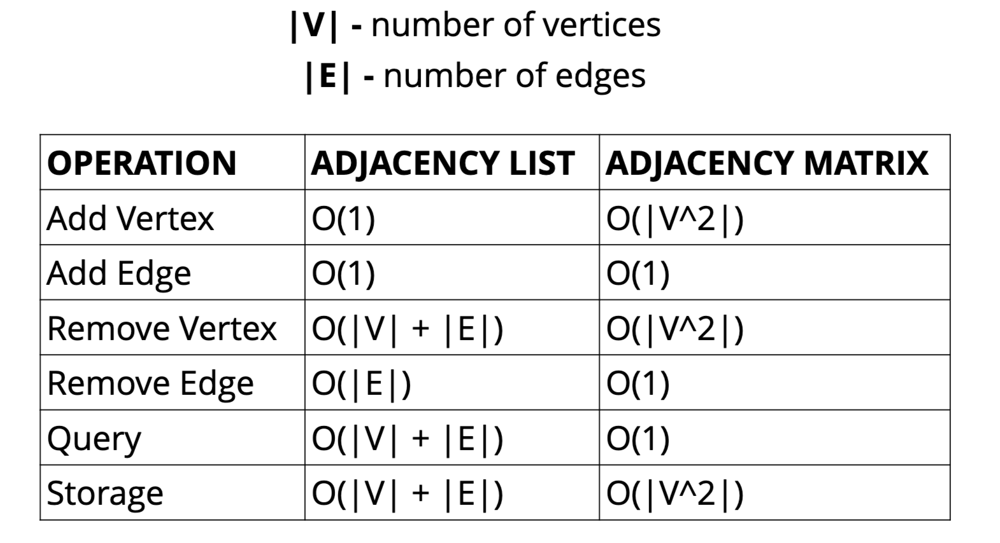
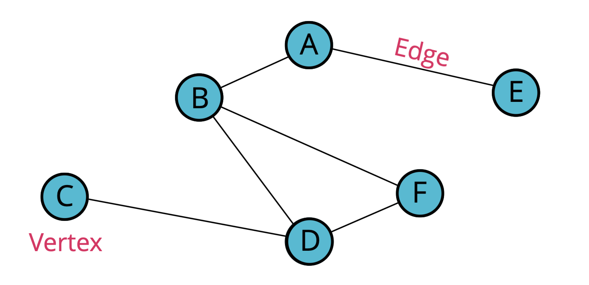
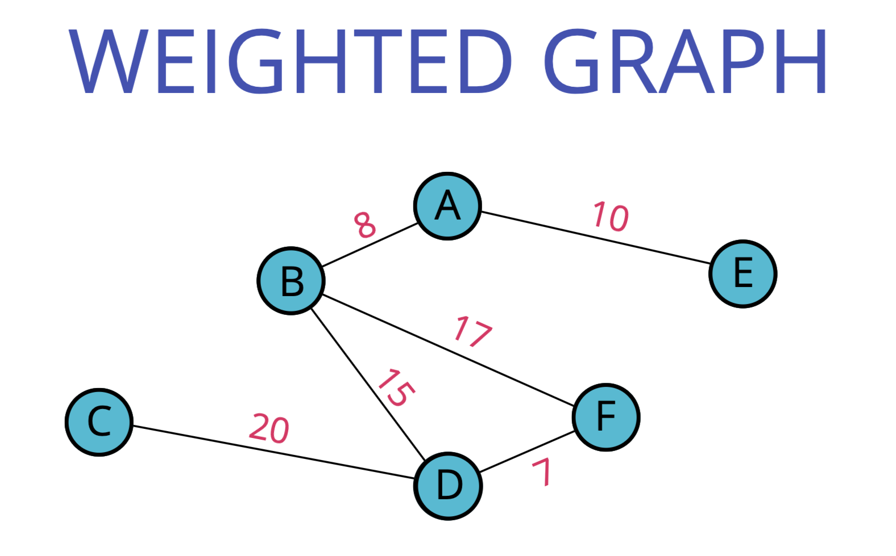
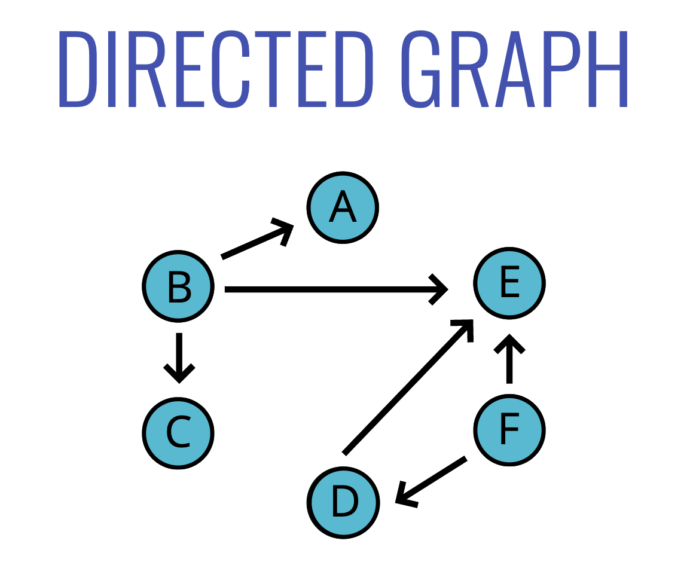
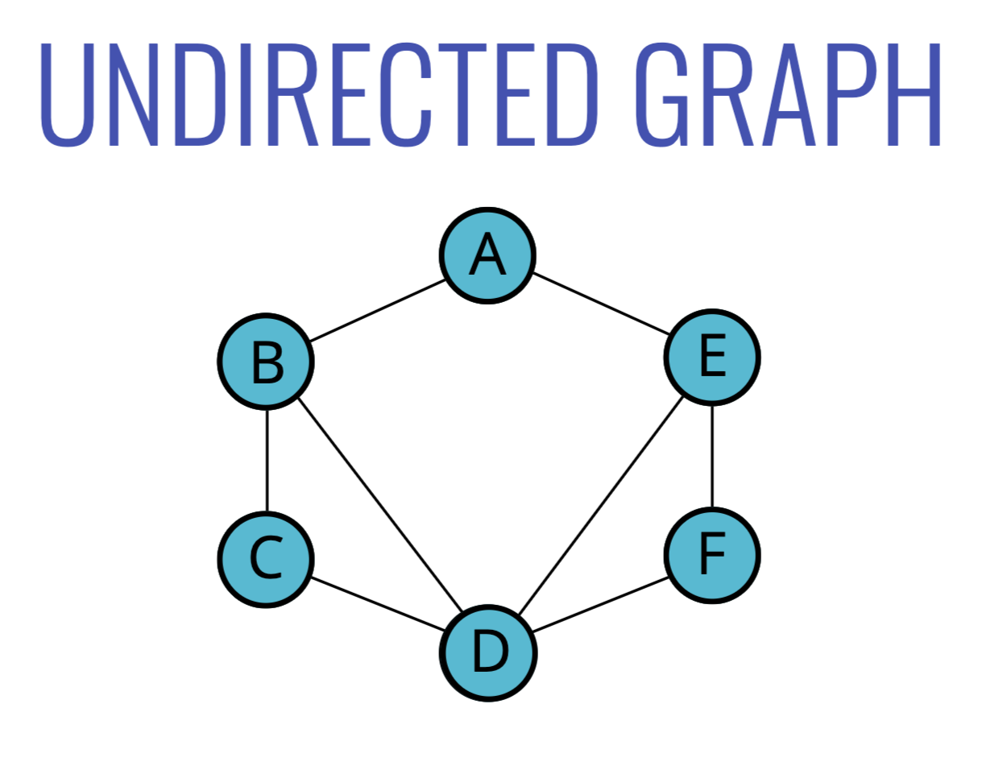
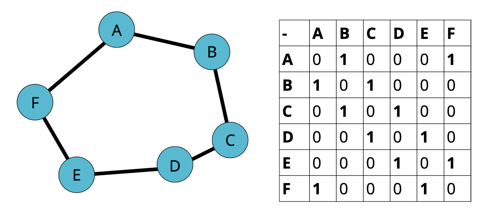
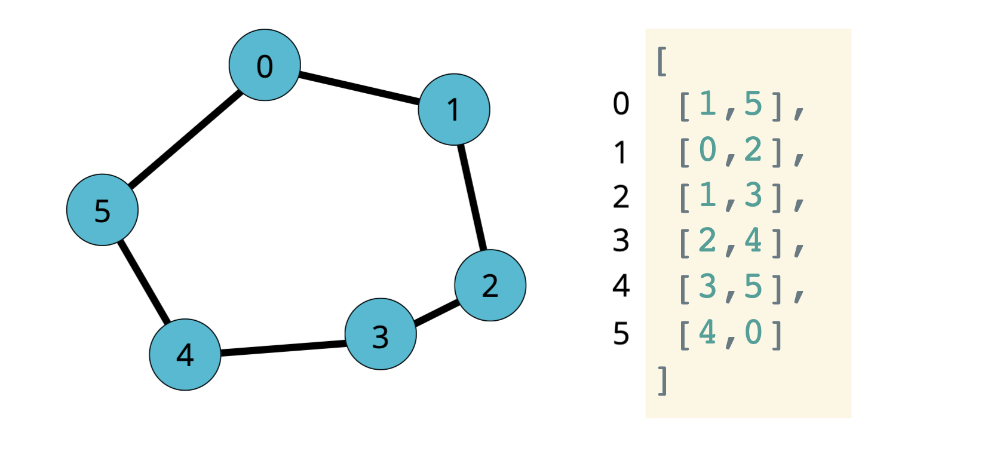
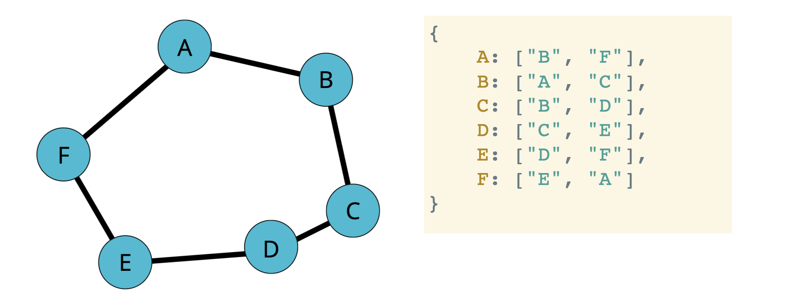

# Graphs Intro
[⬅ Go Back to Home](../README.md)

[⬅ Go Back to Topic](/graphs.md)

## Notes
- Collection of nodes and connections between nodes
  - Unordered - **undirected**
  - Ordered - **directed**
- Uses for graphs:
  - Social networks
  - Location / mapping
  - Routing algorithms
  - Visual hierarchy
  - File system optimizations
  - Everywhere!!!
- **We will use an adjacency list** because most data in the real-world tends to lend itself to sparser and/or larger graphs
## Big O

## Vertices and Edges

- Vertex is the fancy and technical term for a node

## Weighted

- Value is assigned to the edge

### Directed Graphs

- Often represented with arrows
- Direction assigned to edge
- Not a two-way direction (not all vertices have access to other vertices)

### Undirected Graphs

- No direction to edges

## Storing Graphs
### Adjacency Matrix

- Takes up more space (in sparse graphs)
- Slower to iterate over all edges
- Faster to lookup specific edge

### Adjacency List

- Can take up less space (in sparse graphs)
- Faster to iterate over all edges
- Can be slower to lookup specific edge