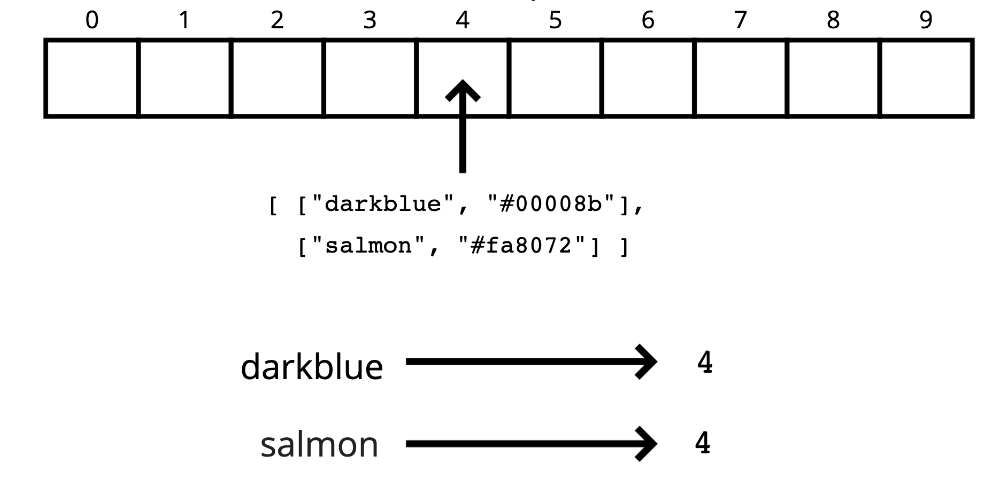
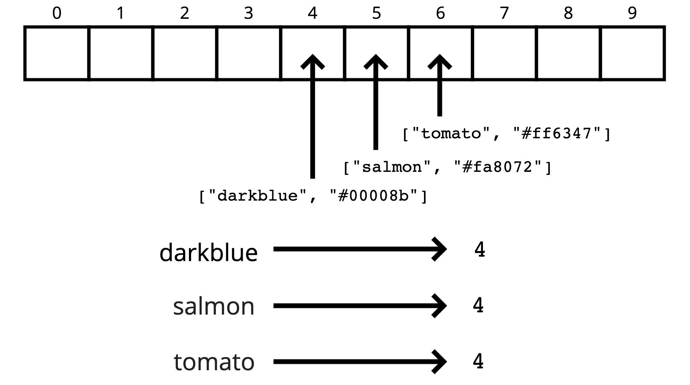

# Hash Function
[⬅ Go Back to Home](../README.md)

[⬅ Go Back to Topic](/hash-tables.md)

## Notes
- Used to store key-value pairs
- Fast for:
  - Finding values
  - Adding new values
  - Removing values
- In JavaScript, OBJECTS AND MAPS are built-in
- In order to look up values by key, we need a way to convert keys into valid array indices (hash functions)

### A Good Hash
- Fast (constant time)
- Doesn't cluster outputs at specific indices, but distributes uniformly
- Deterministic (same input yields same output)

## Code
### Simple Hash (Strings Only)
```js
function hash(key, arrayLength) {
  let total = 0;
  for (let char of key) {
    // UTF number
    // charCodeAt(0) - 96 gives alphabetic order
    let value = char.charCodeAt(0) - 96
    total = (total + value) % arrayLength;
  }
  return total;
}

// hash("pink", 10) // 0
// hash("orangered", 10) // 7
// hash("cyan", 10) // 3
```
- Only hashes strings
- Not constant time (linear in key length)
- Could be a little more random
### Slight Improvement
```js
function hash(key, arrayLength) {
  let total = 0;
  let WEIRD_PRIME = 31;
  for (let i = 0; i < Math.min(key.length, 100); i++) {
    let char = key[i];
    let value = char.charCodeAt(0) - 96
    total = (total * WEIRD_PRIME + value) % arrayLength;
  }
  return total;
}
```
- The prime number in the hash is helpful in spreading out the keys more uniformly
  - Also helpful if the array that your'e putting values into has a prime length

## Collisions
- Even with a large array and a great hash function, collisions are inevitable
### Separate Chaining

- At each index in our array we store values using a more sophisticated data structure (e.g., array or linked list)
- Allows us to store multiple key-value pairs at the same index
### Linear Probing

- When we find a collision, we search through the array to find the next empty slot
- Unlike with separate chaining, this allows us to store a single key-value at each index