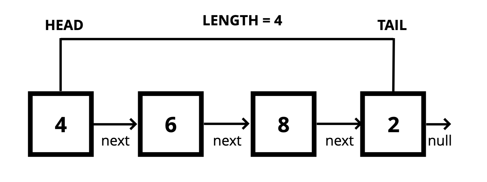
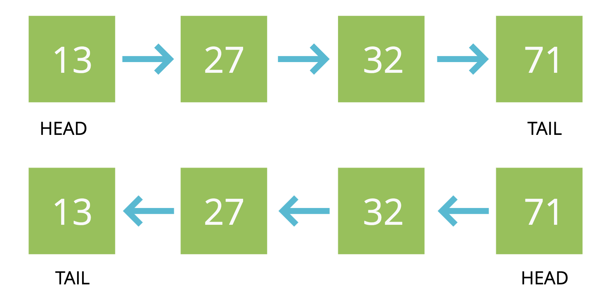

# Singly Linked Lists
[⬅ Go Back to Home](../README.md)

[⬅ Go Back to Topic](/linked-lists.md)



## Notes
- Ordered list of data
- Does NOT have any indices (cannot grab something from the n-th index)
- Contains a **head**, **tail**, and **length** property
- Consists of **nodes**
- Each node has a **value** and a **pointer** to another node or null
- Each node only connects to ONE other node (next node)

### Lists
- Do not have indices
- Connected via nodes with a **next** pointer
- Random access is not allowed
- **Good at insertion and deletion** - main reason to use

### Arrays
- Indexed in order
- Insertion and deletion can be expensive (everything else needs to be re-indexed)
- Can quickly be accessed at a specific index

## Big O
- Time: 
  - Insertion - O(1)
  - Removal
    - O(1) - beginning
    - O(n) - end
  - Searching - O(n)
  - Access - O(n)

## Code
### Full code
```js
class Node {
  constructor(val) {
    this.val = val;
    this.next = null; // at the beginning there is nothing that comes after it
  }
}

class SinglyLinkedList {
  constructor() {
    this.length = 0; // initialized with nothing
    this.head = null;
    this.tail = null;
  }
  push(val) {
    let newNode = new Node(val);
    if (!this.head) {
      this.head = newNode;
      this.tail = newNode; // this.tail = this.head
    } else {
      this.tail.next = newNode;
      this.tail = newNode;
    }
    this.length++
    return this;
  }
  pop() {
    if (this.head === undefined) return undefined; // if (!this.head) return undefined
    let current = this.head;
    let newTail = current;
    while (current.next) {
      newTail = current;
      current = current.next;
    }
    this.tail = newTail;
    this.tail.next = null; // sever the list
    this.length--;
    if (this.length === 0) {
      this.head = null;
      this.tail = null;
    }
    return current;
  }
  shift() {
    if (!this.head) return undefined;
    let current = this.head;
    this.head = current.next;
    this.length--;
    if (this.length === 0) {
      this.tail = null;
    }
    return current;
  }
  unshift(val) {
    let newNode = new Node(val);
    if (!this.head) {
      this.head = newNode;
      this.tail = newNode;
    } else {
      newNode.next = this.head;
      this.head = newNode;
    }
    this.length++;
    return this;
  }
  get(idx) {
    if (idx < 0 || idx >= this.length) return null;
    let count = 0;
    let current = this.head;
    while (count !== idx) {
      current = this.head.next;
      count++;
    }
    return current;
  }
  set(idx, val) {
    let node = this.get(idx);
    if (node) {
      node.val = val;
      return true;
    }
    return false;
  }
  insert(idx, val) {
    if (idx < 0 || idx > this.length) return false;
    if (idx === this.length) return this.push(val);
    if (idx === 0) return this.unshift(val);

    let newNode = new Node(val)
    let prev = this.get(idx - 1)
    let temp = prev.next;
    prev.next = newNode;
    newNode.next = temp;
    this.length++;
    return true;
  }
  remove(idx) {
    if (idx < 0 || idx > this.length) return undefined;
    if (idx === this.length - 1) return this.pop();
    if (idx === 0) return this.shift();

    let prev = this.get(idx - 1);
    let removed = prev.next;
    prev.next = prev.next.next; // prev.next = removed.next
    this.length--;
    return removed;
  }
  reverse() {
    let node = this.head;
    this.head = this.tail;
    this.tail = node;
    let next;
    let prev = null;
    for (let i = 0; i < this.length; i++) {
      next = node.next;
      node.next = prev;
      prev = node;
      node = next;
    }
    return this;
  }
}

let list = new SinglyLinkedList()
```
### Breakdown / Pseudocodes
#### **Push** - adding a new node to the end of the linked list
- This function should accept a value
- Create a new node using the value passed to the function
- **EDGE CASE:** If there is no head property on the list, set the head and tail to be the newly created node
- Otherwise, set the next property on the tail to be the new node and set the tail property on the list to be the newly created node
- Increment the length by one
- Return the linked list
  ```js
  push(val) {
    let newNode = new Node(val);
    if (!this.head) {
      this.head = newNode;
      this.tail = newNode; // this.tail = this.head
    } else {
      this.tail.next = newNode;
      this.tail = newNode;
    }
    this.length++;
    return this;
  }
  ```
#### **Pop** - removing a node from the end of the linked list
- Need to go from head all the way to second to last item to make it the new tail
  -  Cannot get the tail.previous because it is a singly linked list
- If there are no nodes in the list, return undefined
- Loop through the list until you reach the tail
- Set the next property of the 2nd to last node to be null
- Set the tail to be the 2nd to last node
- Decrement the length of the list by 1
- Return the value of the node removed
  ```js
  pop() {
    if (this.head === undefined) return undefined; // if (!this.head) return undefined
    let current = this.head;
    let newTail = current;
    while (current.next) {
      newTail = current;
      current = current.next;
    }
    this.tail = newTail;
    this.tail.next = null; // sever the list
    this.length --;
    if (this.length === 0) {
      this.head = null;
      this.tail = null;
    }
    return current;
  }
  ```
#### **Shift** - remove a node from the beginning of the linked list
- If there are no nodes, return undefined
- Store the current head property in a variable
- Set the head property to be the current head's next property
- Decrement the length by 1
- Return the value of the node removed
  ```js
  shift() {
    if (!this.head) return undefined;
    let current = this.head;
    this.head = current.next;
    this.length --;
    if (this.length === 0) {
      this.tail = null;
    }
    return current;
  }
  ```
#### **Unshift** - adding a new node to the beginning of the linked list
- This function should accept a value
- Create a new node using the value passed to the function
- If there is no head property on the list, set the head and tail to be the newly created node
- Otherwise set the newly created node's next property to be the current head property on the list
- Set the head property on the list to be that newly created node
- Increment the length of the list by 1
- Return the linked list
  ```js
  unshift(val) {
    let newNode = new Node(val);
    if (!this.head) {
      this.head = newNode;
      this.tail = newNode;
    } else {
      newNode.next = this.head;
      this.head = newNode;
    }
    this.length++;
    return this;
  }
  ```
#### **Get** - retrieving a node by its position in the linked list
- This function should accept an index
- If the index is less than zero or greater than or equal to the length of the list, return null
- Loop through the list until you reach the index and return the node at that specific index
  ```js
  get(idx) {
    if (idx < 0 || idx >= this.length) return null;
    let count = 0;
    let current = this.head;
    while (count !== idx) {
      current = this.head.next;
      count++;
    }
    return current;
  }
  ```
#### **Set** - changing the value of a node based on its position in the linked list
- This function should accept an index and a value
- Use the **get** function to find the specific node
- If the node is not found, return false
- Otherwise set the value of that node to be the value passed to the function and return true
  ```js
  set(idx, val) {
    let node = this.get(idx);
    if (node) {
      node.val = val;
      return true;
    }
    return false;
  }
  ```
#### **Insert** - adding a new node to the linked list at a specific position
- This function should accept an index and a value
- If the index is less than zero or greater than the length of the list, return false
- If the index is the same as the length, push a new node to the end of the list
- If the index is zero, unshift a new node to the start of the list
- Otherwise, using the **get** method, access the node at the index - 1
- Set the next property on that node to be the new node
- Set the next property on the new node to be the previous next
- Increment the length
- Return true
  ```js
  insert(idx, val) {
    if (idx < 0 || idx > this.length) return false;
    if (idx === this.length) return this.push(val);
    if (idx === 0) return this.unshift(val);

    let newNode = new Node(val)
    let prev = this.get(idx - 1)
    let temp = prev.next;
    prev.next = newNode;
    newNode.next = temp;
    this.length++;
    return true;
  }
  ```
#### **Remove** - removing a node from the linked list at a specific position
- This function should accept an index
- If the index is less than zero or greater than the length of the list, return undefined
- If the index is the same as the length - 1, pop
- If the index is zero, shift
- Otherwise, using the **get** method, access the node at the index - 1
- Set the next property on that node to be the next of the next node
- Decrement the length
- Return the value of the node removed
  ```js
  remove(idx) {
    if (idx < 0 || idx > this.length) return undefined;
    if (idx === this.length - 1) return this.pop();
    if (idx === 0) return this.shift();

    let prev = this.get(idx - 1);
    let removed = prev.next;
    prev.next = prev.next.next; // prev.next = removed.next
    this.length--;
    return removed;
  }
  ```
#### **Reverse** - reversing the linked list **in place**

- Swap the head and the tail
- Create a variable called next
- Create a variable called prev
- Create a variable called node and initialize it to the head property
- Loop through the list
- Set next to be the next property on whatever node is
- Set the next property on the node to be whatever prev is
- Set prev to be the value of the node variable
- Set the node variable to be the value of the next variable
  ```js
  reverse() {
    let node = this.head;
    this.head = this.tail;
    this.tail = node;
    let next;
    let prev = null;
    for (let i = 0; i < this.length; i++) {
      next = node.next;
      node.next = prev;
      prev = node;
      node = next;
    }
    return this;
  }

  // [100, 201, 250, 350, 999]
  // 999 -> 350 -> 250 -> 201 -> 100 -> null
  ```