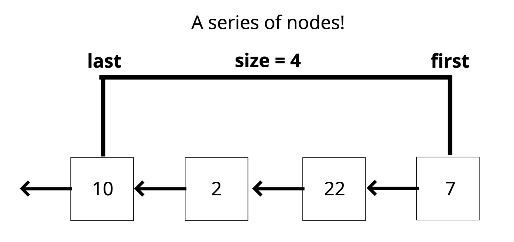

# Stacks
[⬅ Go Back to Home](../README.md)

[⬅ Go Back to Topic](/stacks-queues.md)



## Notes
- **LIFO** - Last In First Out
  - Last element added to the stack will be the first element removed from the stack
    - Think of a stack of plates, books, etc. The last thing (topmost) gets removed first
- Where stacks are used:
  - Managing function invocations (call stack)
  - Undo/redo
  - Routing (history)
- A concept / set of rules
- Not a built in data structure in JavaScript but can be easily implemented
- Prioritize constant time insertion and removal (pop/push) in a stack

## Big O
- Time:
  - **Insertion - O(1)**
  - **Removal - O(1)**
  - Searching - O(n)
  - Access - O(n)

## Linked List Implementation
### Full Code
```js
class Stack { 
  constructor() {
    this.first = null;
    this.last = null;
    this.size = 0;
  }
}

class Node {
  constructor(val) {
    this.val = val;
    this.next = null;
  }
  push(val) {
    let newNode = new Node(val);
    if (!this.first) {
      this.first = newNode;
      this.last = newNode;
    } else {
      let current = this.first;
      this.first = newNode;
      this.first.next = current;
    }
    return this.size++
  }
  pop() {
    if (!this.first) return null;
    let temp = this.first;
    if (this.first === this.last) {
      this.last = null;
    } 
    this.first = this.first.next; 
    this.size--;
    return temp;
  }
}
```
### Breakdown / Pseudocodes
#### **Push** - adding a value to the **top** of the stack
- The function should accept a value
- Create a new node with that value
- If there are no nodes in the stack, set the first and last property to be the newly created node
- If there is at least one node, create a variable that stores the current first property on the stack
- Reset the first property to be the newly created node
- Set the next property on the node to be the previously created variable
- Increment the size of the stack by 1
  ```js
  push(val) {
    let newNode = new Node(val);
    if (!this.first) {
      this.first = newNode;
      this.last = newNode;
    } else {
      let current = this.first;
      this.first = newNode;
      this.first.next = current;
    }
    return this.size++
  }
  ```
#### **Pop** - removing a value from the  **top** of the stack
- If there are no nodes in the stack, return null
- Create a temporary variable to store the first property on the stack
- If there is only 1 node, set the first and last property to be null
- If there is more than 1 node, set the first property to be the next property on the current first
- Decrement the size by 1
- Return the value of the node removed
  ```js
  pop() {
    if (!this.first) return null;
    let temp = this.first;
    if (this.first === this.last) {
      this.last = null;
    } 
    this.first = this.first.next; // if this.last is null, this will set this.first to be null too
    this.size--;
    return temp;
  }
  ```
## Array Implementation
```js
let stack = [];
stack.push("google");
stack.push("instagram");
stack.push("youtube");

stack; // ["google", "instagram", "youtube"]
stack.pop();
stack; // ["google", "instagram"]
```
```js
// Not as good as using push/pop because everything needs to get re-indexed if adding/deleting from the beginning of an array
stack.unshift("created new file");
stack.unshift("resized file");
stack.unshift("cloned out wrinkle");

stack; // ["cloned out wrinkle", "resized file", "created new file"]
stack.shift();
stack; // ["cloned out wrinkle", "resized file"]
```
