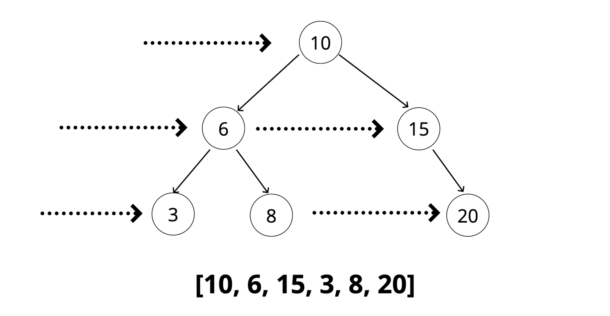
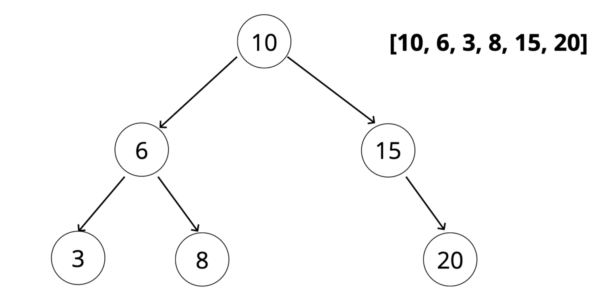
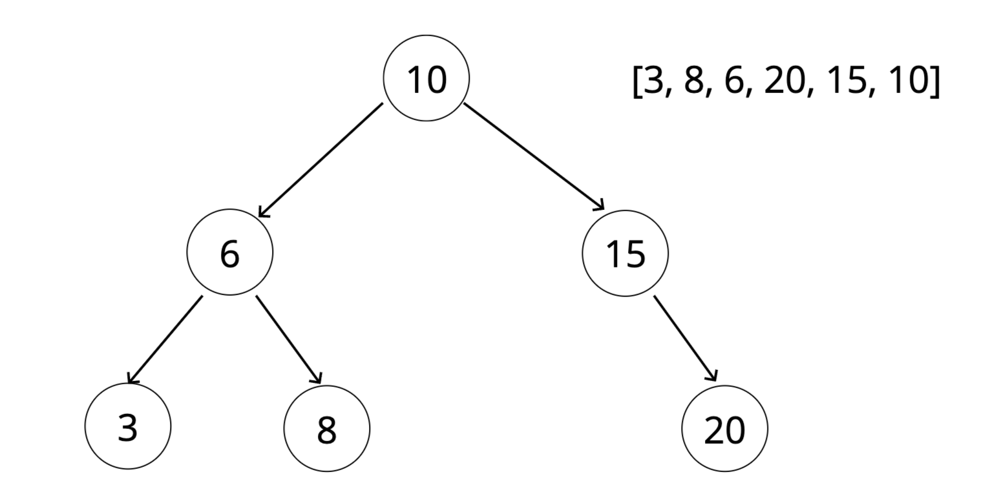
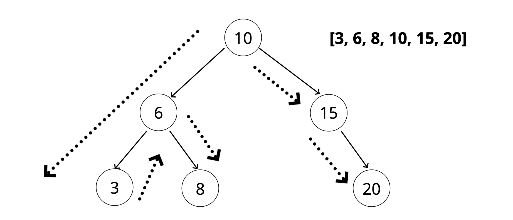

# Tree Traversal (BFS, DFS)
[⬅ Go Back to Home](../README.md)

[⬅ Go Back to Topic](/trees.md)

## Notes
- Given any tree, you can visit every node once

## When to Use BFS and DFS
- Time complexity is the same
- Space complexity depends on size of the tree
### **DFS**
- Lots of nodes to keep track of
#### InOrder
- **DFS InOrder is commonly used with BST**
- Get all data from tree in order
#### PreOrder
- Can be used to "export" a tree structure so that it is easily reconstructed or copied
### **BFS**
- Fewer nodes to keep track of

## Breadth First Search 
- Visit all sibling nodes (same level) before children

### Code
```js
BFS() {
  let data = [];
  let queue = [];
  let node = this.root;
  queue.push(this.root);
  while(queue.length) {
    node = queue.shift();
    data.push(node);
    if (node.left) queue.push(node.left);
    if (node.right) queue.push(node.right);
  }
  return data;
}
```
```js
      10
    6   15
  3  8    20

queue:[6, 15]
data: [10]

queue: [15, 3, 8]
data: [10, 6]

queue: [3, 8, 20]
data: [10, 6, 15]

queue: []
data: [10, 6, 15, 3, 8, 20]
```
### Pseudocode
- Create a queue (this can be an array - FIFO) and a variable to store the values of nodes visited
- Place the root node in the queue
- Loop as long as there is anything in the queue
  - Dequeue a node from the queue and push the value of the node into the variable that stores the nodes
  - If there is a left property on the node dequeued - add it to the queue
  - If there is a right property on the node dequeued - add it to the queue
- Return the variable that stores the values

## Depth First PreOrder
1. Visit node (root)
2. Visit entire left side
3. Visit entire right side

### Code
```js
DFSPreOrder() {
  let data = [];
  let current = this.root;
  
  function traverse(node) {
    data.push(node.val)
    if (node.left) traverse(node.left);
    if (node.right) traverse(node.right);
  }
  traverse(current);
  return data
}
```
### Pseudocode
- Create a variable to store the values of nodes visited
- Store the root of the BST in a variable called current
- Write a helper function which accepts a node
  - Push the value of the node to the variable that stores the values
  - If the node has a left property, call the helper function with the left property on the node
  - If the node has a right property, call the helper function with the right property on the node
- Invoke the helper function with the current variable
- Return the array of values

## Depth First PostOrder
1. Visit the left side
2. Visit the right side
3. Visit node (root)

### Code
```js
DFSPostOrder() {
  let data = [];
  let current = this.root;
  
  function traverse(node) {
    if (node.left) traverse(node.left);
    if (node.right) traverse(node.right);
    data.push(node.val)
  }
  traverse(current);
  return data
}
```
### Pseudocode
- Create a variable to store the values of nodes visited
- Store the root of the BST in a variable called current
- Write a helper function which accepts a node
  - If the node has a left property, call the helper function with the left property on the node
  - If the node has a right property, call the helper function with the right property on the node
  - Push the value of the node to the variable that stores the values
- Invoke the helper function with the current variable
- Return the array of values

## Depth First InOrder

1. Visit the left side
2. Visit node (root)
3. Visit the right side
### Code
```js
DFSInOrder() {
  let data = [];
  let current = this.root;
  
  function traverse(node) {
    if (node.left) traverse(node.left);
    data.push(node.val)
    if (node.right) traverse(node.right);
  }
  traverse(current);
  return data
}
```
### Pseudocode
- Create a variable to store the values of nodes visited
- Store the root of the BST in a variable called current
- Write a helper function which accepts a node
  - If the node has a left property, call the helper function with the left property on the node
  - Push the value of the node to the variable that stores the values
  - If the node has a right property, call the helper function with the right property on the node
- Invoke the helper function with the current variable
- Return the array of values