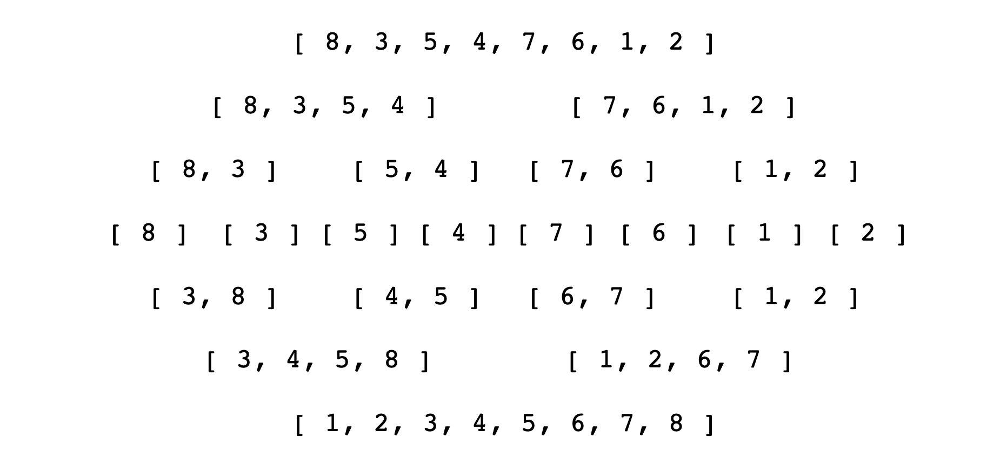

# Merge Sort
[⬅ Go Back](/sort.md)



## Notes
- Combination of merging and sorting
- Exploits the fact that arrays of 0 or 1 elements are always sorted
- Worked by decomposing an array into smaller arrays of 0 or 1 elements, then building up a newly sorted array

## Big O
- Time: O(n log n)
  - O(log n) decompositions (number of times we split)
  - O(n) comparisons per decomposition
- Space: O(n)

## Merging arrays
- In order to implement merge sort, it's useful to first implement a function responsible for merging two sorted arrays
- Given two arrays which are sorted, this helper function should create a new array which is also sorted, and consists of all of the elements in the two input arrays
- This function should run in O(n + m) time and O(n + m) space and **should not** modify the parameters passed to it
  - n is the first array, m is the second array
### Pseudocode
- Create an empty array, take a look at the smallest values in each input array
- While there are still values we haven't looked at...
  - If the value in the first array is smaller than the value in the second array, push the value in the first array into our results and move on to the next value in the first array
  - If the value in the first array is larger than the value in the second array, push the value in the second array into our results and move on to the next value in the second array
  - Once we exhaust one array, push in all remaining values from the other array
### Code
```js
function merge(arr1, arr2) {
  let results = [];
  let i = 0; // arr1 index
  let j = 0; // arr2 index
  while (i < arr1.length && j < arr2.length) {
    if (arr2[j] > arr[i]) {
      results.push(arr1[i])
      i++
    } else {
      results.push(arr2[j])
      j++
    }
  }
  while(i < arr1.length) {
    results.push(arr1[i])
    i++
  }
  while (j < arr2.length) {
    results.push(arr2[j])
    j++
  }
  return results;
}
```

## Sorting
### Pseudocode
- Break up the array into halves until you have arrays that are empty or have one element (use .slice)
- Once you have smaller sorted arrays, merge those arrays with other sorted arrays until you are back at the full length of the array
- Once the array has been merged back together, return the merged (and sorted) array
### Code
```js
function mergeSort(arr) {
  if(arr.length <= 1) return arr;
  let mid = Math.floor(arr.length / 2)
  let left = mergeSort(arr.slice(0, mid))
  let right = mergeSort(arr.slice(mid))
  return merge(left, right)
}

mergeSort([10, 24, 76, 73])
  left = [10, 24]
    return mergeSort([10, 24])
      left = [10]
      right = [24]
      merge([10], [24]) // [10, 24]
  right = [76, 73]
    return mergeSort([76, 73])
      left = [76]
      right = [73]
      merge([76], [73]) // [73, 76]
    
  merge([10, 24], [76, 73]) // [10, 24, 73, 76]
```