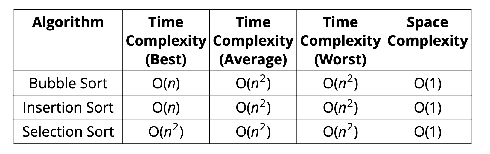

# Types of Sorts
[⬅ Go Back](/sort.md)

## Why do I need to know different types of sorts?
- There are many different ways to sort things, and different techniques have their own advantages and disadvantages
- Classic interview topic because it has so many different approaches

## [Sorts](https://www.toptal.com/developers/sorting-algorithms)
#### JavaScript built-in sort method
- But it doesn't always work the way you expect
  ```js
  [6, 4, 15, 10].sort();
  // [10, 15, 4, 6]
  ```
- Accepts an optional *comparator* function to say how to sort

### Less commonly used sort methods because they're less efficient:
#### [Bubble Sort](/sort/bubble-sort.md) - Largest value "bubbles" up to the top
- Time: O(n^2)
#### [Selection Sort](/sort/selection-sort.md) - Smallest value is placed at the beginning on each pass
- Time: O(n^2)
#### [Insertion Sort](/sort/insertion-sort.md) - Build up a sort on left portion of array by inserting/swapping values
- Time: O(n^2)


- In the grand scheme of things, bubble sort, selection sort, and insertion sort are all roughly equivalent
- These sorting methods work best when the data is small but it doesn't scale well

### More advanced sort methods:
#### [Merge Sort](/sort/merge-sort.md) - Breaks array into halves until it only has 0 or 1 elements and then merges into a sorted array
- Time: O(n log n)
- Space: O(n)
#### [Quick Sort](/sort/quick-sort.md) - Uses a pivot to figure out where it should end up in the final sorted array
- Time:
  - Best and average: O(n log n)
  - Worst: O(n^2)
- Space: O(log n)
#### [Radix Sort](/sort/radix-sort.md) - Separate into buckets (by last digit) and reform into an array to sort
- Time: O(nk) -> n is number of things that are being sorted, k is length of the thing being sorted
- Space: O(n + k)
